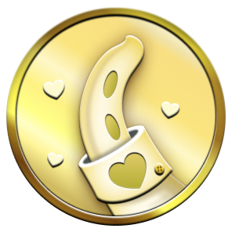
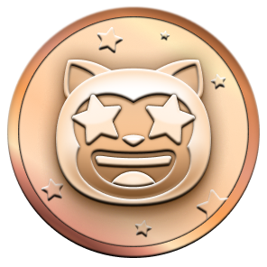
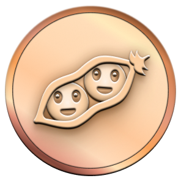
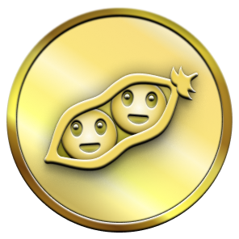
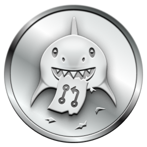
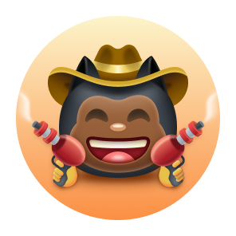

# Github Badges Achievements

  <picture>
    <source media="(prefers-color-scheme: light)" srcset="https://user-images.githubusercontent.com/65187002/172940015-d9d072e7-c47d-4ddd-83f6-8e7717a721b8.png">
    
  </picture> 
  <picture>
    <source media="(prefers-color-scheme: light)" srcset="https://user-images.githubusercontent.com/65187002/172941127-4061fac1-736b-4c24-b7ea-c210b3578cc5.png">
    
  </picture>

# Displaying Achievements 

#### Displaying achievements on your profile is completely optional; by default, they can be seen by anyone viewing your public profile.

#### You can opt out from having achievements displayed on your profile by going to your [profile settings](https://github.com/settings).
 
# Achievement List 📃
 

| Badge | Name | How to get | Needed amount | 
| :-: | :-: | :-: | :-: |
|  | Heart On Your Sleeve | (???) | <table>  <thead>  <tr>  <th>DEFAULT</th> <th>BRONZE</th>  <th>SILVER</th>  <th>GOLD</th>  </tr>  </thead>  <tbody>  <tr>  <td align="center"></td>   <td></td>  <td></td>  <td></td>  </tr>  <tr>  <td align="center">(?)</td>  <td align="center">(?)</td>  <td align="center">(?)</td>  <td align="center">(?)</td>  </tr>   </tbody>  </table> |
|  | Open Sourcerer | (???) | <table>  <thead>  <tr>  <th>DEFAULT</th> <th>BRONZE</th>  <th>SILVER</th>  <th>GOLD</th>  </tr>  </thead>  <tbody>  <tr>  <td align="center"></td>   <td></td>  <td></td>  <td></td>  </tr>  <tr>  <td align="center">(?)</td>  <td align="center">(?)</td>  <td align="center">(?)</td>  <td align="center">(?)</td>  </tr>   </tbody>  </table> |
|                  | Starstruck         | Created a repository that has many stars | <table>  <thead>  <tr>  <th>DEFAULT</th> <th>BRONZE</th>  <th>SILVER</th>  <th>GOLD</th>  </tr>  </thead>  <tbody>  <tr>  <td align="center"></td>   <td></td>  <td></td>  <td></td>  </tr>  <tr>  <td align="center">16</td>  <td align="center">128</td>  <td align="center">512</td>  <td align="center">4096</td>  </tr>   </tbody>  </table>      |
|                  | Quickdraw        | Gitty up! (closed an issue / pull request within 5 minutes of opening) | <table>  <thead>  <tr>  <th>DEFAULT</th>  </tr>  </thead>  <tbody>  <tr>  <td></td> </tr>  <tr>  <td align="center">1</td> </tr>   </tbody>  </table> |
|      | Pair Extraordinaire  | Coauthored commits on merged pull request | <table>  <thead>  <tr>  <th>DEFAULT</th> <th>BRONZE</th>  <th>SILVER</th>  <th>GOLD</th>  </tr>  </thead>  <tbody>  <tr>  <td align="center"></td>   <td></td>  <td></td>  <td></td>  </tr>  <tr>  <td align="center">1</td>  <td align="center">10</td>  <td align="center">24</td>  <td align="center">48</td>  </tr>   </tbody>  </table>      |
|      | Pull Shark  | Opened a pull request that has been merged | <table>  <thead>  <tr>  <th>DEFAULT</th> <th>BRONZE</th>  <th>SILVER</th>  <th>GOLD</th>  </tr>  </thead>  <tbody>  <tr>  <td align="center"></td>   <td></td>  <td></td>  <td></td>  </tr>  <tr>  <td align="center">2</td>  <td align="center">16</td>  <td align="center">128</td>  <td align="center">1024</td>  </tr>   </tbody>  </table>      |
|  | Galaxy Brain | Answered a discussion (got an accepted answer) | <table>  <thead>  <tr>  <th>DEFAULT</th> <th>BRONZE</th>  <th>SILVER</th>  <th>GOLD</th>  </tr>  </thead>  <tbody>  <tr>  <td></td>  <td></td>  <td></td>  <td></td>  </tr>  <tr>  <td align="center">2</td> <td align="center">8</td>  <td align="center">16</td>  <td align="center">32</td>  </tr>   </tbody>  </table>
|                  | YOLO        | Merged a pull request without a review | <table>  <thead>  <tr>  <th>DEFAULT</th>  </tr>  </thead>  <tbody>  <tr>  <td></td> </tr>  <tr>  <td align="center">1</td> </tr>   </tbody>  </table> |
|                  | Public Sponsor        | Sponsored an open source contributor through [GitHub Sponsors](https://github.com/sponsors) | <table>  <thead>  <tr>  <th>DEFAULT</th>  </tr>  </thead>  <tbody>  <tr>  <td></td> </tr>  <tr>  <td align="center">1</td> </tr>   </tbody>  </table> |

 

# Achievement Skin Tone 👋

#### Some achievements' appearance depends on your Emoji Skin Tone Preference.

#### You can change your preferred Skin Tone by going to [appearance settings](https://github.com/settings/appearance).

 

| Badge | Name | Skin Tone Versions | 
| :-: | :-: | :-: |
|                  | Starstruck         | <table>  <thead>  <tr>  <th>👋</th> <th>👋🏻</th>  <th>👋🏼</th>  <th>👋🏽</th>  <th>👋🏾</th>  <th>👋🏿</th>  </tr>  </thead>  <tbody>  <tr>  <td align="center"></td>   <td align="center"></td>  <td align="center"></td>  <td align="center"></td>  <td align="center"></td>   <td align="center"></td>   </tr>   <tr>  <td align="center">👋</td> <td align="center">👋🏻</td>  <td align="center">👋🏼</td>  <td align="center">👋🏽</td>  <td align="center">👋🏾</td>  <td align="center">👋🏿</td>  </tr>  </tbody>  </table>      |
|                  | Quickdraw         | <table>  <thead>  <tr>  <th>👋</th> <th>👋🏻</th>  <th>👋🏼</th>  <th>👋🏽</th>  <th>👋🏾</th>  <th>👋🏿</th>  </tr>  </thead>  <tbody>  <tr>  <td align="center"></td>   <td align="center"></td>  <td align="center"></td>  <td align="center"></td>  <td align="center"></td>   <td align="center"></td>   </tr>   <tr>  <td align="center">👋</td> <td align="center">👋🏻</td>  <td align="center">👋🏼</td>  <td align="center">👋🏽</td>  <td align="center">👋🏾</td>  <td align="center">👋🏿</td>  </tr>  </tbody>  </table>      |

 

# Badges no longer earnable ❌
 

| Badge | Name | How to get | Needed amount | 
| :-: | :-: | :-: | :-: |
|      | Mars 2020 Contributor  | Contributed code to a repository used in the [Mars 2020 Helicopter Mission](https://github.com/readme/featured/nasa-ingenuity-helicopter) | <table>  <thead>  <tr>  <th>DEFAULT</th>  </tr>  </thead>  <tbody>  <tr>  <td></td> </tr>  <tr>  <td align="center">1</td> </tr>   </tbody>  </table> |
|  | Arctic Code Vault Contributor | Contributed code to a repository in the [2020 GitHub Archive Program](https://archiveprogram.github.com/) | <table>  <thead>  <tr>  <th>DEFAULT</th>  </tr>  </thead>  <tbody>  <tr>  <td></td> </tr>  <tr>  <td align="center">1</td> </tr>   </tbody>  </table> |

 

# Complete list of all GitHub Profile badges and Achievements

#### Displaying achievements on your profile is completely optional; by default, they can be seen by anyone viewing your public profile.

You can opt out from having achievements displayed on your profile by going to your [profile settings](https://github.com/settings).

 

| Badge | Name | How to get                                                                                                                                                       |
| :---: | --- |------------------------------------------------------------------------------------------------------------------------------------------------------------------|
|  | **Heart On Your Sleeve** | React to something on GitHub with a ❤️ emoji **(Being tested)** |
|  | **Open Sourcerer** | User had PRs merged in multiple public repositories **(Being tested)** |
|  | **Starstruck** | Created a repository that has **16 stars**.                                                                                              |
|  | **Quickdraw** | Closed an issue or a pull request within 5 min of opening.                                                                                                       |
|  | **Pair Extraordinaire** | Coauthored in a **two** or merged pull request.                                                                                             |
|  | **Pull Shark** | **2 pull requests** merged.                                                                                                            |
|  | **Galaxy Brain** | 2 accepted answers.                                                                                                                      |
|  | **YOLO** | Merged **at least one** pull request without code review .                                                                                                       |
|  | **Public Sponsor** | Sponsoring open source work via [GitHub Sponsors](https://github.com/sponsors)                                                                                  |
|  | **Mars 2020 Contributor** | Contributed code to repositories used in the [Mars 2020 Helicopter Mission](https://github.com/readme/featured/nasa-ingenuity-helicopter). *Now unable to earn.* |
|  | **Arctic Code Vault Contributor** | Contributed code to a repository in the [2020 GitHub Archive Program](https://archiveprogram.github.com/). *Now unable to earn.*                                 |

 

## Badge Tiers

Some Achievements not only have the base version, but also tiers.

| Achievement | Default | Bronze | Silver | Gold |
| --- | :---: | :---: | :---: | :---: |
| **Starstruck** |  |  |  |  |
| | 16 stars | 128 stars | 512 stars | 4096 stars |
| **Pair Extraordinaire** | ![Achievement badge Pair Extraordinaire][pe-default] | ![Bronze badge Pair Extraordinaire][pe-bronze] | ![Silver badge Pair Extraordinaire][pe-silver] | ![Gold badge Pair Extraordinaire][pe-gold] |
| | 1 pull requests  [@gomzyakov](https://github.com/gomzyakov?achievement=pair-extraordinaire&tab=achievements) | 10 pull requests | 24 pull requests  | 48 pull requests |
| **Pull Shark** | ![Achievement badge Pull Shark][ps-default] | ![Bronze badge Pull Shark][ps-bronze] | ![Silver badge Pull Shark][ps-silver] | ![Gold badge Pull Shark][ps-gold] |
| | 2 pull requests | 16 pull requests | 128 pull requests | 1024 pull requests |
| **Galaxy Brain** | ![Achievement badge Galaxy Brain][gb-default] | ![Bronze badge Galaxy Brain][gb-bronze] | ![Silver badge Galaxy Brain][gb-silver] | ![Gold badge Galaxy Brain][gb-gold] |
| | 2 answers | 8 answers | 16 answers | 32 answers |
| **Heart On Your Sleeve** |  |  |  |  |
| | ??? | ??? | ??? | ??? |
| **Open Sourcerer** |  |  |  |  |
| | ??? | ??? | ??? | ??? |

[ss-bronze]: https://github.githubassets.com/images/modules/profile/achievements/starstruck-bronze.png
[ss-silver]: https://github.githubassets.com/images/modules/profile/achievements/starstruck-silver.png
[ss-gold]: https://github.githubassets.com/images/modules/profile/achievements/starstruck-gold.png

[pe-default]: https://github.githubassets.com/images/modules/profile/achievements/pair-extraordinaire-default.png
[pe-bronze]: https://github.githubassets.com/images/modules/profile/achievements/pair-extraordinaire-bronze.png
[pe-silver]: https://github.githubassets.com/images/modules/profile/achievements/pair-extraordinaire-silver.png
[pe-gold]: https://github.githubassets.com/images/modules/profile/achievements/pair-extraordinaire-gold.png

[ps-default]: https://github.githubassets.com/images/modules/profile/achievements/pull-shark-default.png
[ps-bronze]: https://github.githubassets.com/images/modules/profile/achievements/pull-shark-bronze.png
[ps-silver]: https://github.githubassets.com/images/modules/profile/achievements/pull-shark-silver.png
[ps-gold]: https://github.githubassets.com/images/modules/profile/achievements/pull-shark-gold.png

[gb-default]: https://github.githubassets.com/images/modules/profile/achievements/galaxy-brain-default.png
[gb-bronze]: https://github.githubassets.com/images/modules/profile/achievements/galaxy-brain-bronze.png
[gb-silver]: https://github.githubassets.com/images/modules/profile/achievements/galaxy-brain-silver.png
[gb-gold]: https://github.githubassets.com/images/modules/profile/achievements/galaxy-brain-gold.png

 

## Highlights Badges

| Badge | Name | How to achieve |
| --- | --- | --- |
|  | **Pro** | Use [GitHub Pro](https://docs.github.com/en/get-started/learning-about-github/githubs-products#github-pro) |
|  | **Discussion answered** | Have  your reply to a discussion marked as the answer |
|  | **Developer Program Member** | Be a registered member of the [GitHub Developer Program](https://docs.github.com/en/developers/overview/github-developer-program) |
|  | **Security Bug Bounty Hunter** | Helped out hunting down security vulnerabilities at [GitHub Security](https://bounty.github.com/) |
| ![Light badge GitHub Campus Expert][gce-dark]![Dark badge GitHub Campus Expert][gce-light] | **GitHub Campus Expert** | Participate in the [GitHub Campus Program](https://education.github.com/experts) |
| ![Dark badge Security advisory credit][SAC-dark]![Light badge Security advisory credit][SAC-light] | **Security advisory credit** | Have your security advisory submitted to the [GitHub Advisory Database](https://github.com/advisories) accepted |

[gce-dark]: https://user-images.githubusercontent.com/65187002/173082819-b3625c23-bfd6-4492-b828-56ed91c45f52.svg#gh-dark-mode-only
[gce-light]: https://user-images.githubusercontent.com/65187002/173082836-08be81fe-13b7-4acf-9096-e5241d76f237.svg#gh-light-mode-only
[SAC-dark]: https://user-images.githubusercontent.com/65187002/173084051-79a0a626-1c1a-4d60-afdf-50ad001d7b21.svg#gh-dark-mode-only
[SAC-light]: https://user-images.githubusercontent.com/65187002/173084071-5f321da2-b2a9-490b-a524-1b21fa384d7e.svg#gh-light-mode-only

# More information ℹ️

#### You can find more information about GitHub Badges under this [link](https://docs.github.com/en/account-and-profile/setting-up-and-managing-your-github-profile/customizing-your-profile/personalizing-your-profile#displaying-badges-on-your-profile).

 

## Do you have some ideas?

If you have questions or suggestions on how to improve the information on this page, you can always write to [issues](https://github.com/github-profile-achievements/english/issues).

# Achievements & Display 🏅

#### Achievements are pins that GitHub gives to your GitHub account as a reward for certain activities and can be seen in your profile. These achievements give a good effect to your GitHub account and can indicate the amount of your activity and how you are active.

#### You can opt out from having achievements displayed on your profile by going to your [profile settings](https://github.com/settings).

#### Here we show you how to get GitHub Achievement pin's step by step :)

 

# Achievement List 📃

 

## How to Get Quickdraw Achievement

### Quickdraw has one of the easiest ways to receive . and you can receive it by just taking a few steps. To get this achievement you must . (closed an issue / pull request within 5 minutes of opening)

#### - If you need more help, click on the How to Get button to get a step-by-step tutorial on how to get this achievement.

 

## How to Get Yolo Achievement

### Yolo is one of the most beautiful achievements of Github, which can give a very beautiful effect to your Github profile. To get this achievement, you need to Merge a pull request without a review.

#### - If you need more help, click on the How to Get button to get a step-by-step tutorial on how to get this achievement.

 

## How to Get Galaxy Brain Achievement

### Getting Galaxy Brain is more difficult than the previous two achievements. And to receive it, you need to go through the steps that you need other GitHub users. You need to : Answered a discussion(got an accepted answer two times)

#### - If you need more help, click on the How to Get button to get a step-by-step tutorial on how to get this achievement.

 

## How to Get Pull Shark Achievement

### To get pull shark you need to make 2 merged pull request, you will get the one pull shark badge.

#### - If you need more help, click on the How to Get button to get a step-by-step tutorial on how to get this achievement.

 

## How to Get Starstruck Achievement

### It's too simple to get Starstruck Achievement & you have few steps to get Starstruck . You can get this Achievement When a Repository on your account hits 16 stars, even if it was transferred, you will receive the badge.

#### - If you need more help, click on the How to Get button to get a step-by-step tutorial on how to get this achievement.

 

## How to Get Pair Extraordinaire Achievement

### You can earn the pair extraordinaire badge by co-authoring a pull request that then gets merged.

#### - If you need more help, click on the How to Get button to get a step-by-step tutorial on how to get this achievement.

 

## How to Get Public Sponsor Achievement

### You just need to make a donation to some open source contributor.

#### - If you need more help, click on the How to Get button to get a step-by-step tutorial on how to get this achievement.

 

# Unreleased Achievements ⏳

 

## Heart On Your Sleeve

### the 'Heart On Your Sleeve' achievement badges is not yet released to public GitHub users at the moment.

 

## Open Sourcerer

### the 'Open Sourcerer' achievement badges is not yet released to public GitHub users at the moment.

 

# Badges no longer earnable ❌

 

## Mars 2020 Contributor

### Contributed code to a repository used in the Mars 2020 Helicopter Mission

## Arctic Code Vault Contributor

### Contributed code to a repository in the 2020 GitHub Archive Program

  

# © 2023 Dawid Olko. All rights reserved. 
